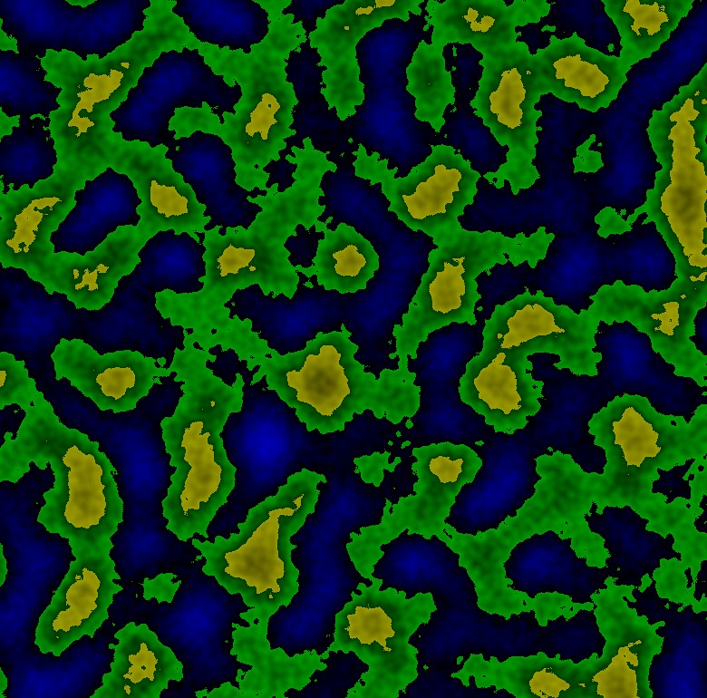

지형생성알고리즘 with <strong>glfw</strong> and <strong>opengl</strong>
- https://www.cs.cmu.edu/~112/notes/student-tp-guides/Terrain.pdf
- https://github.com/go-gl/glfw
- https://github.com/go-gl/gl
- https://www.youtube.com/watch?v=6BdYzfVOyBY&ab_channel=ProgrammingChaos
---
Windows 10 환경\
빌드 후 실행
```
go build -o bin/terrain-generation.exe .
```
```
.\bin\terrain-generation.exe
```
실행
```
go run .
```
결과:

